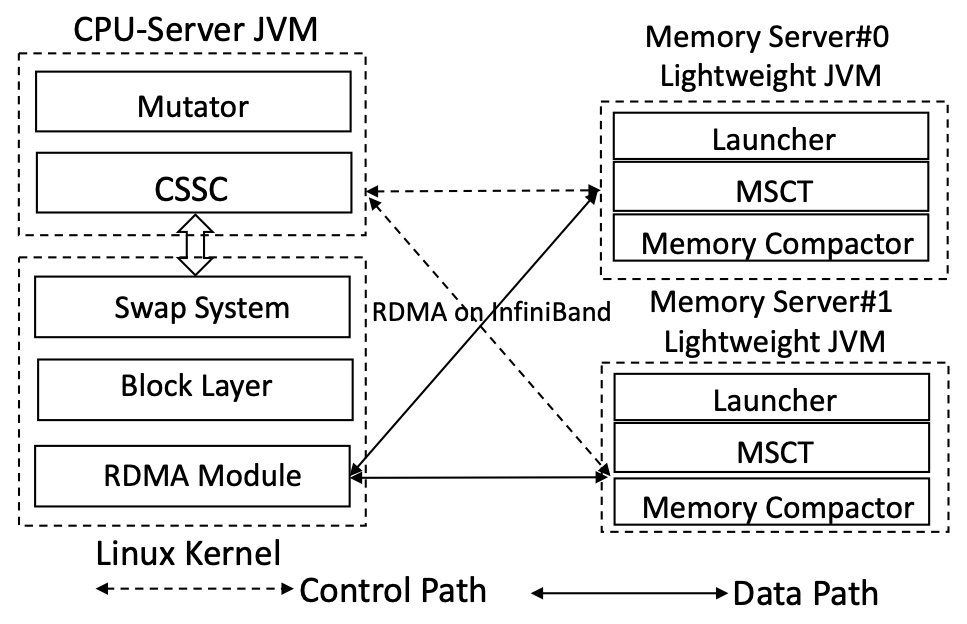

# 1. Summary of Semeru

*Semeru* is a managed runtime built for a memory disaggregated cluster where each managed application uses one CPU server and multiple memory servers. When launched on *Semeru*, the process runs its application code (mutator) on the CPU server, and the garbage collector on both the CPU server and memory servers in a coordinated manner. Due to task offloading and moving computation close to data, *Semeru* significantly improves the locality for both the mutator and GC and, hence, the end-to-end performance of the application. Please refer to our OSDI'20 paper **[Semeru: A Memory-Disaggregated Managed Runtime](https://www.usenix.org/system/files/osdi20-wang.pdf)** for more details.

# 2. Setup environments

- **Hardware: Intel servers with InfiniBand**
- **Run-time environment: OpenJDK 12.02, Linux-4.11-rc8, CentOS 7.5(7.6) with MLNX-OFED 4.3(4.5)**
- **Code licenses: The GNU General Public License (GPL)**

# 3. Description

## 3.1 *Semeru*'s Codebase

*Semeru* contains the following three components:

- the Linux kernel, which includes a modified swap system, block layer and a RDMA module

- the CPU-server Java Virtual Machine (JVM)

- the Memory-server lightweight Java Virtual Machine (LJVM)

  These three components and their relationships are illustrated in figure below:
  
  

 

 

## 3.2 Deploying Semeru

To build *Semeru*, the first step is to download its source code:

​	<code>git clone git@github.com:uclasystem/Semeru.git </code>

When deploying *Semeru*, install the three components in the following order: the kernel on the CPU server, the *Semeru* JVM on the CPU server, and the LJVM on each memory server. Finally, connect the CPU server with memory servers before running applications.

#### CPU Server Kernel Installation

We first discuss how to build and install the kernel.

- Modify *grub* and set transparent_hugepage to *madvise*:

  <pre><code>sudo vim /etc/default/grub 
  + transparent_hugepage=madvise </code></pre>

- Install the kernel and restart the machine:

  <pre><code>cd Semeru/Linux-4.11-rc8
  sudo ./build_kernel.sh build
  sudo ./build_kernel.sh install
  sudo reboot</code></pre>	

- Install the MLNX-OFED driver. We download the MLNX_OFED_LINUX-4.5-1.0.1.0-rhel7.6-x86_64, and install it against our newly built kernel:

  <pre><code># Install the same MLNX_OFED driver on both the CPU server and memory servers
  # Please refer to the Mellanox website for more details.
  cd MLNX_OFED_LINUX-4.5-1.0.1.0-rhel7.6-x86_64
  sudo mlnxofedinstall --add-kernel-support</code></pre>

  After installing the OFED driver, please confirm the RDMA works well between the CPU server and memory servers.

- Build and install *Semeru* RDMA module

  <pre><code># Add the IP of each memory server into
  # Semeru/linux-4.11-rc8/include/linux/swap_global_struct.h
  # e.g., the Infiniband IPs of the 2 memory servers are 10.0.0.2 and 10.0.0.4
  char * mem_server_ip[][] = {"10.0.0.2","10.0.0.4"}; 
  uint16_t mem_server_port = 9400;
  # Then build the Semeru RDMA module
  make</code></pre>

#### Install the CPU-Server JVM

We next discuss the steps to build and install the CPU-server JVM.

- Download Oracle JDK 12 to build *Semeru* JVM

  <pre><code># Assume jdk 12.02 is under path: ${home_dir}/jdk12.0.2 
  # Or change the path in shell script, Semeru/CPU-Server/build_cpu_server.sh
  boot_jdk="${home_dir}/jdk12.0.2" </code></pre>

- Build the CPU-server JVM

  <pre><code># ${build_mode} can be one of the three modes:
  # slowdebug, fastdebug, or release.
  # We recommend slowdebug mode to debug the JVM code 
  # and release mode to test the performance.
  # Please make sure both the CPU server and 
  # memory servers use the same build mode.
  cd Semeru/CPU-Server/
  ./build_cpu_server.sh ${build_mode}
  ./build_cpu_server.sh build
  # Take release mode as example — the compiled JVM will be in:
  # Semeru/CPU-Server/build/linux-x86_64-server-release/jdk </code></pre>

#### Install the Memory-Server LJVM

The next step is to install the LJVM on each memory server.

- Download OpenJDK 12 and build the LJVM

  <pre><code># Assume OpenJDK12 is under the path: ${home_dir}/jdk-12.0.2
  # Or you can change the path in the script  
  # Semeru/Memory-Server/build_mem_server.sh
  boot_jdk="${home_dir}/jdk-12.0.2"</code></pre>

- Change the IP addresses

  <pre><code># E.g., mem-server #0’s IP is 10.0.0.2, memory server ID is 0.
  # Change the IP address and ID in file:
  # Semeru/Memory-Server/src/hotspot/share/
  # utilities/globalDefinitions.hpp
  # @Mem-server #0
  #define NUM_OF_MEMORY_SERVER 2
  #define CUR_MEMORY_SERVER_ID 0
  static const char cur_mem_server_ip[] = "10.0.0.2";
  static const char cur_mem_server_port[]= "9400";</code></pre>

- Build and install the LJVM

  <pre><code># Use the same ${build_mode} as the CPU-server JVM.
  cd Semeru/Memory-Server/
  ./build_memory_server.sh ${build_mode}
  ./build_memory_server.sh build
  ./build_memory_server.sh install
  # The compiled Java home will be installed under:
  # {home_dir}/jdk12u-self-build/jvm/openjdk-12.0.2-internal
  # Set JAVA_HOME to point to this folder.</code></pre>

#### Running Applications

To run applications, we first need to connect the CPU server with memory servers. Next, we mount the remote memory pools as a swap partition on the CPU server. When the application uses more memory than the limit set by *cgroup*, its data will be swapped out to the remote memory via RDMA.

- Launch memory servers

  <pre><code># Use the shell script to run each memory server.
  # ${execution_mode} can be execution or gdb.
  # @Each memory server cd Semeru/ShellScrip
  run_rmem_server_with_rdma_service.sh Case1 ${execution_mode}</code></pre>

- Connect the CPU server with memory servers

  <pre><code># @CPU server
  # The default size of remote memory server is 36GB:
  # 4GB meta region and 32GB data regions.
  # If not, assign the data regions size to the parameter 
  # in Semeru/ShellScript/install_semeru_module.sh :
  # SWAP_PARTITION_SIZE="32G"
  # We don't recommend to change the Java heap size right now.
  # Please refer to the Known Issues chapter for more details.
  cd Semeru/ShellScript/
  install_semeru_module.sh semeru
  # To close the swap partition, do the following:
  # @CPU server
  cd Semeru/ShellScript/
  install_semeru_module.sh close_semeru
  # However, caused of the limit of frontswap,
  # We can't remove the registered frontswap device clearly by doing this.
  # We have to restart the cpu server and re-connct the CPU server with memory servers.</code></pre>

- Set a CPU server cache size limit for an application

  <pre><code># E.g., Create a cgroup with 10GB memory limitation.
  # The shellscript will create a cgroup, named as memctl.
  # When setting the CPU server local cache, please leave enough size for the native memory.
  # Refer to the Known Issues chapter for more ditals.
  # @CPU server
  cd Semeru/ShellScript
  cgroupv1_manage.sh create 10g
  # Or delete the cgroup
  cgroupv1_manage.sh delete</code></pre>

- Add a Spark executor into the created *cgroup*

  <pre><code># Add a Spark worker into the cgroup, memctl.
  # Its sub-process, executor, falls into the same cgroup.
  # Modify the function *start_instance* under
  # Spark/sbin/start-slave.sh
  # @CPU server
  cgexec -sticky -g memory:memctl "${SPARK_HOME}/sbin" /sparkdaemon.sh start $CLASS $WORKER_NUM -webui-port "$WEBUI_PORT" $PORT_FLAG $PORT_NUM $MASTER "$@"
  # We also recommend that only run the executor on the CPU-Server JVM.
  # Please refer to the FAQ chapter for more details.
  # In order to achive this, specify the executor JVM in Spark/conf/spark-defaults.conf :
  spark.executorEnv.JAVA_HOME=${semeru_cpu_server_jvm_dir}/jdk</code></pre>

- Launch a Spark application

  Some *Semeru* JVM options need to be added for both CPU-server JVM and LVJMs. CPU-server JVM and memory server LJVMs should use the value for the same JVM option.

  <pre><code># E.g., under the configuration of 25% local memmory
  # 512MB Java heap Region
  # @CPU server
  -XX:+SemeruEnableMemPool -XX:EnableBitmap -XX:-UseCompressedOops -Xnoclassgc -XX:G1HeapRegionSize=512M -XX:MetaspaceSize=0x10000000 -XX:SemeruLocalCachePercent=25
  # @Each memory server
  # ${MemSize}: the memory size of current memory server
  # ${ConcThread}: the number of concurrent threads
  -XX:SemeruEnableMemPool -XX:-UseCompressedOops -XX:SemeruMemPoolMaxSize=${MemSize} -XX:SemeruMemPoolInitialSize=${MemSize} -XX:SemeruConcGCThreads=${ConcThread}
  # We provide some shellscript examples for Spark applications under the directory: Semeru/ShellScrip/SparkAppShellScrip
  # Please check their JVM parameters.</code></pre>

# FAQ

*Semeru* is an academic proterotype to show the benefits of managing data on disaggreagted datacenters cross-layers. It does have some limitations and  we will keep updating the code of *Semeru*. If you encounter any problems, please open an issue or feel free to contact us: 

Chenxi Wang *wangchenxi@cs.ucla.edu*; 

Haoran Ma *haoranma@cs.ucla.edu*.

#### 1. How many JVMs can run on the CPU server ?

At this moment, only one JVM can run on the CPU server. When launch the Spark cluster, multiple daemon processes run in the backgroud, e.g., Worker, Executors. Each process is a separate JVM process. The Worker process is used for management and the  Executor process is used for real computation. Please only let the Executor process runs on *Semeru* CPU server JVM. One Executor per CPU server. 

#### 2. Which part of data can be swapped out to memory servers ?

Part of the Meta space and all the Data space (Java heap) can be swapped out to memory servers via the data path. Some meta variables can't be swapped out to memory servers, even they are used as the purpose on both the CPU server and memory servers. Because these variables contain virtual functions. For the same object instance, the virtual functions' addresses are usually different in the CPU server and memory servers. Swapping out these objects instances from CPU server to memory servers are not safe.

# Known Issues

We have found some unfixed issues. Some of them are potential optimizations that can be applied. Some of them are potential bugs.  We will fix them and update the code latter.

#### 1. Using too much native memory can cause Out-Of-Memory error.

In our design, only part of the Meta space and the Data space (Java heap) can be swapped out to memory servers. If the Java application uses too much native memory which exceeds the CPU server local capacity, the process will be killed by the Out-Of-Memory error. We will add a dedicated remote memory pool on the memory servers for the native memory space later.

#### 2. Some meta data in CPU server JVM can be freed. 

In order to do concurrent tracing, G1 GC maintains some large data structures, e.g., the bitmap. Its size can reach up to 1/32 of the Java heap size. *Semeru* moved all the concurrent tracing to memory servers. There is no need to keep these meta data structures on the CPU server JVM. Removing them can save both time and space overhead.

#### 3. Java heap size is fixed at 32GB, Start at 0x400,100,000,000.

Some meta variables are related to the Java heap size. E.g., the CPU server swap file/partition size, memory servers' alive_bitmap size etc. It's a little hard to change the Java heap size right now. We will update a new version to fix this problem later.
